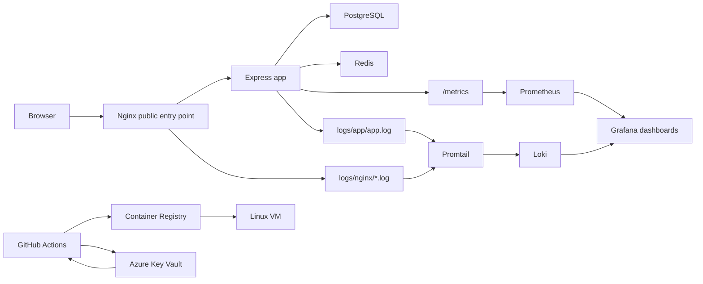
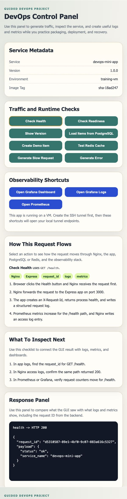

# DevOps Guided Project

This repository is a guided, hands-on DevOps project for junior engineers. The application is intentionally small. The main learning goal is to understand how a service moves through a practical delivery path:

`design request -> local runtime -> observability -> image build -> registry publish -> VM deployment -> validation -> recovery`

This training version intentionally contains guided gaps that students must complete to reach the full working implementation.

## Project Purpose

Treat this repository as the response to a realistic request sent to a DevOps team:

> "We have a small service that needs to run in a training environment. Package it into a container, expose it safely, connect it to PostgreSQL and Redis, make it observable with logs and metrics, publish it through CI, deploy it to a VM, and make validation and recovery straightforward."

This project implements that request with a small Express app, Docker Compose, Nginx, PostgreSQL, Redis, Grafana, Prometheus, Loki, GitHub Actions, a container registry, and two target environments:

- a local environment for fast learning and validation
- a Linux VM environment for production-like deployment practice

Two operational rules are important:

- use `docker-compose.yml` only for the local training stack
- use `docker-compose.vm.yml` only for the VM deployment stack

Do not use the local Compose file on the VM when you want the production-like access model. The VM path is designed so only the app is public, while Grafana and Prometheus stay behind SSH tunnel access.

## Who This Is For

- junior DevOps engineers
- junior cloud engineers
- instructors running a guided workshop
- teams who need a simple but realistic end-to-end delivery example

The repository assumes basic familiarity with Linux commands, Git, Docker basics, and CI/CD concepts. It does not assume deep backend development experience.

## Scope

This project is designed to teach:

- how a service is structured and run with Docker Compose
- how a reverse proxy sits in front of an application
- how PostgreSQL and Redis support application behavior
- how logs and metrics answer different operational questions
- how CI builds and publishes a container image
- how a VM deploy consumes an existing image instead of rebuilding
- how to validate a deployment and recover from simple failures

This project is not intended to teach:

- Kubernetes
- Terraform or Ansible
- large microservice architecture
- complex application business logic
- enterprise-grade secrets or platform hardening

## First Reading Order

If you are opening the repository for the first time, use this order:

1. [Documentation Guide](docs/00-documentation-guide.md)
2. [Prerequisites and Validation](docs/01-prerequisites-and-validation.md)
3. [Architecture](docs/02-architecture.md)
4. [Runtime Stack](docs/03-runtime-stack.md)
5. [App GUI](docs/04-app-gui.md)
6. [Request And Data Flow](docs/05-request-and-data-flow.md)
7. [Logging](docs/06-logging.md)
8. [Monitoring](docs/07-monitoring.md)
9. [Registries](docs/08-registries.md)
10. [Azure Key Vault and Secrets Flow](docs/09-secrets-and-azure-key-vault.md)
11. [VM Deployment](docs/10-vm-deployment.md)
12. [Troubleshooting](docs/11-troubleshooting.md)
13. [Trainee Validation Findings](docs/12-trainee-validation-findings.md)
14. [Trainee Gap Map](docs/13-trainee-gap-map.md)

## Create Your Own Working Copy

This repository is meant to be used as a public course template for hands-on lab work.

Do not do your hands-on work directly in the shared template repository.

Recommended trainee path:

1. Open the template repository on GitHub.
2. Select `Use this template`.
3. Create a new repository in your own GitHub account or team space.
4. Choose the visibility that matches your class or company rules.
5. Clone your own repository copy locally.
6. Add your own GitHub Secrets, Azure secrets, and VM settings to your repository, not to the shared template.
7. Do all lab work on feature branches in your own repository.

Example:

```bash
git clone https://github.com/<your-account>/devops-guided-project.git
cd devops-guided-project
git checkout -b feature/lab-work
```

Why this matters:

- each trainee or team gets an isolated place to store secrets and workflow history
- CI/CD runs belong to the trainee repository that owns the environment
- the public template stays clean and reusable for future classes

## System Summary

At a high level:

- the browser talks to Nginx
- Nginx forwards traffic to the Express app
- the app uses PostgreSQL for persistent data
- the app uses Redis for the cache demo
- the app writes structured logs and exposes metrics
- Prometheus stores metrics
- Promtail ships app and Nginx log files into Loki
- Grafana provides the main observability UI
- GitHub Actions builds and publishes the app image to a container registry
- the project can be validated locally or deployed to a Linux VM with the same core runtime story



For the detailed explanation, read [Architecture](docs/02-architecture.md).

## Expected End State

When the VM path is working, students should expect the public app page to look like this:



When the SSH tunnel is working, Grafana should open on the local forwarded port and show the login page like this before students continue into dashboards and logs:


## Repository Structure

```text
.
├── README.md
├── app/                         # Express app, GUI assets, tests
├── db/                          # PostgreSQL initialization script
├── docker/                      # Dockerfile and Nginx configuration
├── monitoring/                  # Prometheus, Loki, Promtail, Grafana config
├── deploy/                      # VM setup and deployment scripts
├── docs/                        # Ordered documentation set
├── labs/                        # Guided workshop labs
├── logs/                        # Host-side app and Nginx logs
├── scripts/                     # Validation and helper scripts
├── docker-compose.yml           # Local training stack
├── docker-compose.vm.yml        # VM runtime stack
└── .github/workflows/           # CI build/publish and VM deploy workflows
```

## Main Runtime Components

| Component | Role | Public Exposure |
| --- | --- | --- |
| `nginx` | public entry point and reverse proxy | local `:8080`, VM `:80` |
| `app` | GUI, API, metrics, structured logs | internal only |
| `postgres` | persistent `items` data | internal only |
| `redis` | cache demo | internal only |
| `prometheus` | metric storage | local `:9090`, VM localhost-only |
| `grafana` | dashboards and log exploration | local `:3000`, VM localhost-only |
| `loki` | log storage for app and Nginx | internal only |
| `promtail` | log shipping from host files | internal only |

## Setup

Start with [Prerequisites and Validation](docs/01-prerequisites-and-validation.md).

If you are a trainee, create your own GitHub copy from the template before you start the labs.

In the trainee-facing version, complete `DOCKER-01` from [Trainee Gap Map](docs/13-trainee-gap-map.md) before expecting the first local `docker compose up --build` run to succeed.

If you want the short version:

```bash
bash scripts/validate-prerequisites.sh
cp .env.example .env
docker compose up --build
```

Then validate the local stack:

```bash
bash scripts/validate-local-stack.sh foundation
```

For the VM path, do not reuse the local Compose file. Use `docker-compose.vm.yml`, then confirm the tunnel-friendly layout with:

```bash
bash scripts/validate-runtime-contract.sh vm http://127.0.0.1
```

## Local Usage Flow

1. Start the stack with `docker compose up --build`.
2. Open the GUI at [http://localhost:8080](http://localhost:8080).
3. Use the GUI to generate health, readiness, DB, cache, slow, and error traffic.
4. Validate the base stack with `bash scripts/validate-local-stack.sh foundation`.
5. Complete the guided gaps in [Trainee Gap Map](docs/13-trainee-gap-map.md) as you reach each lab milestone.
6. Inspect logs in Grafana Explore or with `docker compose logs`.
7. Inspect metrics in Grafana and Prometheus.
8. Run `cd app && npm ci && npm test` when you need the app test path.

Local URLs:

- app GUI: [http://localhost:8080](http://localhost:8080)
- Grafana: [http://localhost:3000](http://localhost:3000)
- Prometheus: [http://localhost:9090](http://localhost:9090)

## Target Environment Choices

You can use this project in two environment paths:

- Linux VM path
  - recommended when VM access is available
  - best when you want production-like image pull, SSH deployment, and smoke-test practice
  - ideal for CI/CD, deploy approval, and rollback practice
  - validate with `bash scripts/validate-vm-deployment.sh http://YOUR_VM_OR_LOCAL_URL`
- local environment path
  - fallback or parallel learning path when VM access is not available yet
  - best when you want fast feedback
  - ideal for app, runtime, observability, and most guided gaps
  - validate with `bash scripts/validate-local-stack.sh foundation`, `bash scripts/validate-local-stack.sh full`, and `bash scripts/validate-observability.sh`

The recommended course path is still the VM deployment route when the environment is available.
If VM access is not available yet, the local path still covers most of the operational learning goals and keeps the journey moving.

## Validation Scripts

These scripts are part of the expected workflow, not optional extras.

- `bash scripts/validate-prerequisites.sh`
- `bash scripts/validate-local-stack.sh foundation`
- `bash scripts/validate-local-stack.sh full`
- `bash scripts/validate-observability.sh`
- `bash scripts/validate-vm-deployment.sh http://YOUR_VM_OR_LOCAL_URL`
- `bash scripts/validate-runtime-contract.sh local`
- `bash scripts/validate-runtime-contract.sh vm http://127.0.0.1`
- `bash scripts/validate-doc-journey.sh`
- `bash scripts/validate-project.sh`
- `bash scripts/print-vm-access.sh YOUR_VM_PUBLIC_IP YOUR_VM_USER [/path/to/key.pem]`

Use the runtime contract validator only after the matching local or VM stack is already running.

Use the VM deployment validator only for image-based VM deploys. It now fails if `/version` still shows a local validation build, unless you explicitly override it with `ALLOW_LOCAL_VM_BUILD=1` for temporary instructor debugging.

Reset helpers for safe retries:

- `bash scripts/reset-local-lab.sh`
- `bash scripts/reset-vm-lab.sh`

## CI/CD Flow

The repository now uses a simple production-like delivery model:

1. work happens on a feature branch
2. open a pull request into `main`
3. GitHub Actions runs required PR CI checks
4. merge into `main` only after CI passes
5. GitHub Actions builds and publishes the app image to a container registry
6. the production deploy waits for GitHub Environment approval
7. the VM deploys the immutable `sha-<short-sha>` image tag

The workflows are:

- `.github/workflows/ci.yml`
  - runs on pull requests into `main`
  - tests the app
  - validates the documentation journey and static runtime contract
  - runs a lightweight dependency security scan
  - validates workflow, shell, and Compose syntax
- `.github/workflows/publish-image.yml`
  - runs on push to `main`
  - reruns the essential validation path
  - builds and publishes the app image to a container registry
  - pushes both `latest` and `sha-<short-sha>` tags
  - runs a lightweight image dependency scan against the published app image
- `.github/workflows/deploy-production.yml`
  - starts automatically after a successful publish from `main`
  - pauses at the `production` environment approval gate
  - deploys the selected image to the Ubuntu VM
  - can also be run manually for rollback or recovery
  - requires an explicit image tag when run manually so rollback stays intentional

Related reading:

- [Registries](docs/08-registries.md)
- [Azure Key Vault and Secrets Flow](docs/09-secrets-and-azure-key-vault.md)
- [VM Deployment](docs/10-vm-deployment.md)

### Branch Protection Model

Treat `main` as the production-ready branch.

- do day-to-day work on feature branches
- open pull requests into `main`
- require the PR CI workflow to pass before merge
- deploy only code that has already been merged into `main`

Recommended GitHub branch protection settings for instructors:

- require a pull request before merging
- require these status checks to pass:
  - `test-and-validate`
  - `dependency-scan`
  - `workflow-and-compose-check`
- require at least one approval when repository permissions allow it
- require branches to be up to date before merging
- block direct pushes to `main`
- restrict force pushes
- restrict branch deletion
- optionally require conversation resolution
- review admin bypass carefully instead of leaving it on by habit
- optionally prefer squash merge to keep the trainee history simple

## VM Deployment Summary

The Linux VM deployment path is intentionally simple:

1. prepare the VM with `deploy/vm-setup.sh`
2. provide `.env` and runtime secrets
3. wait for the image to be published from `main`
4. approve the `production` environment deploy
5. pull the published app image from the registry
6. start the VM stack with `docker-compose.vm.yml`
7. validate `/health`, `/ready`, and `/version`
8. use an SSH tunnel for Grafana on the VM

If you need to copy the source to the VM from a workstation instead of cloning it there, use:

```bash
bash scripts/package-vm-source.sh
```

That helper avoids macOS metadata files that can break Linux-side provisioning.

For a simple rollback to a previously known good image tag, use:

```bash
bash deploy/rollback.sh sha-<known-good-sha-tag>
```

The VM never rebuilds the application. It only pulls a published image tag that can be traced back to a Git commit and CI run.

The local environment remains a valid fallback and parallel validation target when the recommended VM path is not available.

## Labs

The labs are designed to match the delivery story:

- [LAB-00 Course Map](labs/LAB-00-course-map.md)
- [LAB-01 Run Locally and Use GUI](labs/LAB-01-run-locally-and-use-gui.md)
- [LAB-02 Compose Layers DB Cache](labs/LAB-02-compose-layers-db-cache.md)
- [LAB-03 Nginx Reverse Proxy](labs/LAB-03-nginx-reverse-proxy.md)
- [LAB-04 Logging Dashboard](labs/LAB-04-logging-dashboard.md)
- [LAB-05 Metrics and Grafana](labs/LAB-05-metrics-and-grafana.md)
- [LAB-06 GitHub Actions and Registry Publish](labs/LAB-06-github-actions-acr.md)
- [LAB-07 Deploy to VM](labs/LAB-07-deploy-to-vm.md)
- [LAB-08 Failure and Recovery](labs/LAB-08-failure-and-recovery.md)

## Operational Notes

- Nginx is the only public entry point by design.
- The app is not meant to be exposed directly.
- On the VM, Grafana and Prometheus stay localhost-only by default.
- Loki only stores app and Nginx logs in this course. PostgreSQL and Redis logs stay in CLI logs to keep the scope manageable.
- The project favors explicit files and visible runtime behavior over abstraction.

## Where To Go Next

- new engineer: [Documentation Guide](docs/00-documentation-guide.md)
- guided workshop path: [LAB-00 Course Map](labs/LAB-00-course-map.md)
- deployment work: [VM Deployment](docs/10-vm-deployment.md)
- when something is broken: [Troubleshooting](docs/11-troubleshooting.md)
